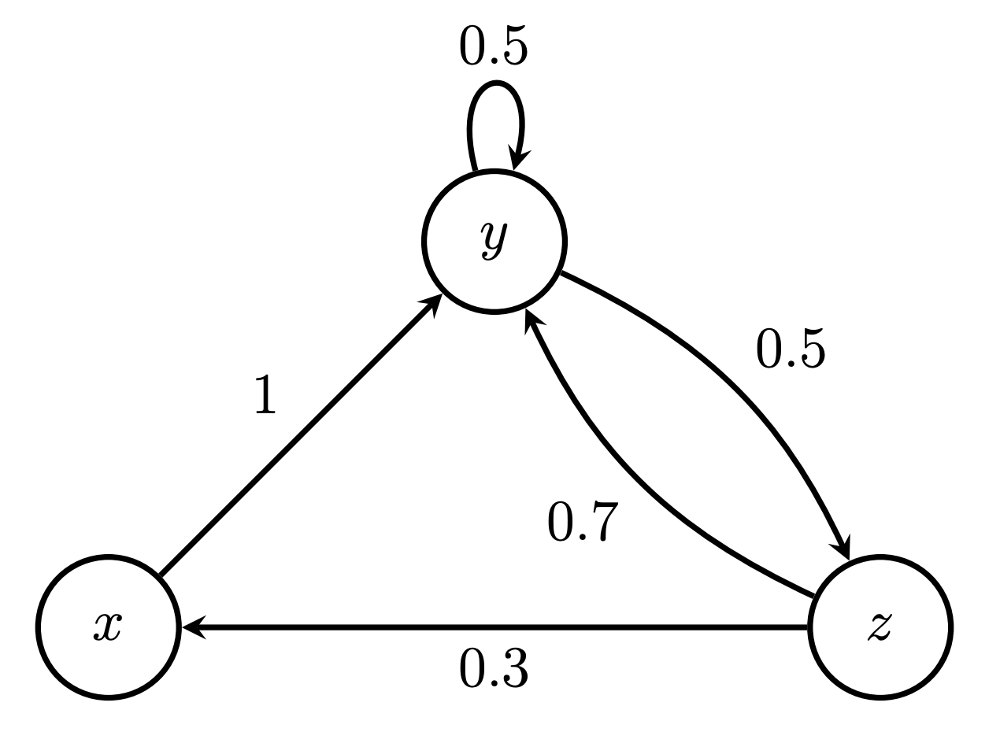
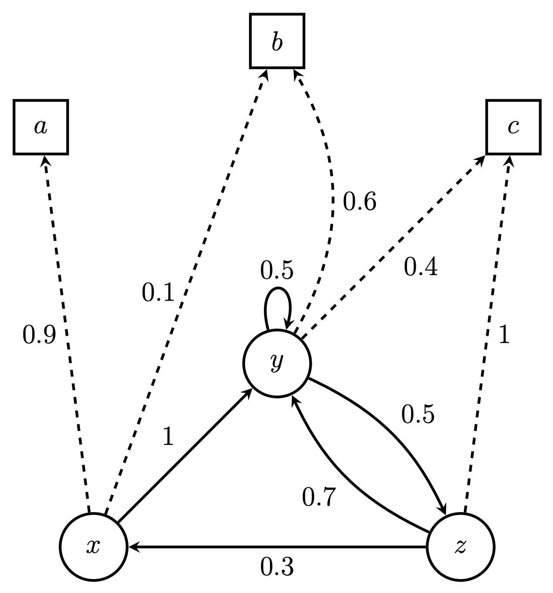
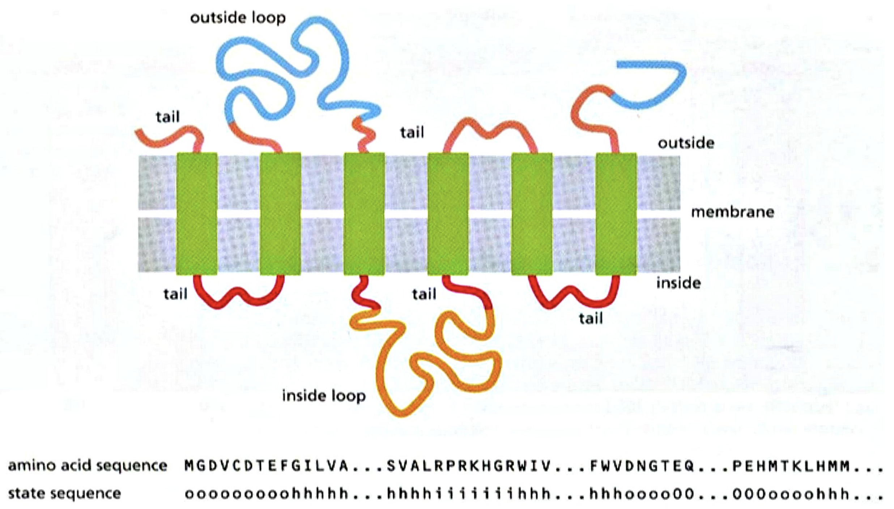

# Hidden Markov Models: Bio Prediction

Machine learning and Hidden Markov Models application to the transmembrane protein secondary structure prediction. Awarded as the best final-year Informatics project in Serbia.

The publication can be found [here](https://www.mg.edu.rs/uploads/files/images/stories/dokumenta/maturski/marina-ivanovic.pdf).

## What are Hidden Markov Models?

A Markov Chain is a system that expresses transitions from one state to another, with certain probabilities. 

A Hidden Markov Model (HMM) is a Markov Chain in which the state sequence is unobservable. What could be observed is a sequence of outputs. Every produced output at a given moment depends only on the current state.

|  | |
|:---:|:---:|
| Example of a Markov Chain | Example of a Hidden Markov Model |

## How can HMMs be applied to the protein structure prediction?

A protein structure could be modeled as a HMM, where every amino acid is an output, and its position a state.

|  |
|:---:|
| Example of a protein and its position, relative to a cell membrane |

## What are the algorithms implemented in this project?

Among others, the Baum-Welch algorithm is implemented for the unknown parameters estimation, while the Viterbi algorithm is implemented for finding the most likely sequence of hidden states.
